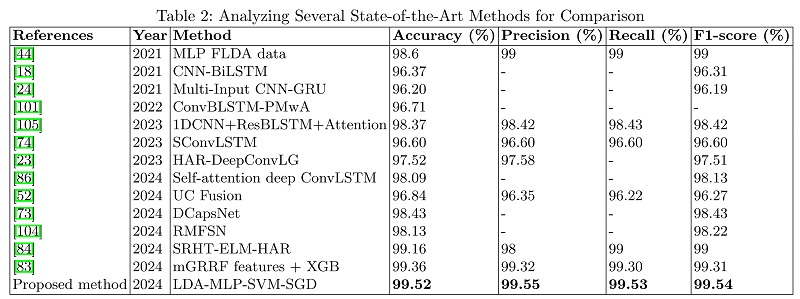

# LDA-MLP-SVM-SGD
Leveraging LDA Feature Extraction to Augment Human Activity Recognition Accuracy

### This research introduces a hybrid feature extraction approach that combines Linear Discriminant Analysis (LDA) and Multilayer Perceptron (MLP) methods to address the challenges of reducing feature vector dimensionality and accurately classifying smartphone-based human activities. Moreover, to refine activity classification accuracy, Support Vector Machine (SVM) optimization with Stochastic Gradient Descent (SGD) is employed. LDA, a statistical tool, is leveraged to derive a new feature space for data projection, enhancing class separation and test feature label prediction. The proposed approach, named LMSS, was evaluated using the UCI-HAR dataset and compared with state-of-the-art models. The results demonstrate that the proposed approach outperformed the best-performing method over this dataset. It achieved an accuracy rate of 99.52%, precision of 99.55%, recall of 99.53%, and an F1-score of 99.54%, highlighting the effectiveness of the proposed method in accurately classifying the data.

